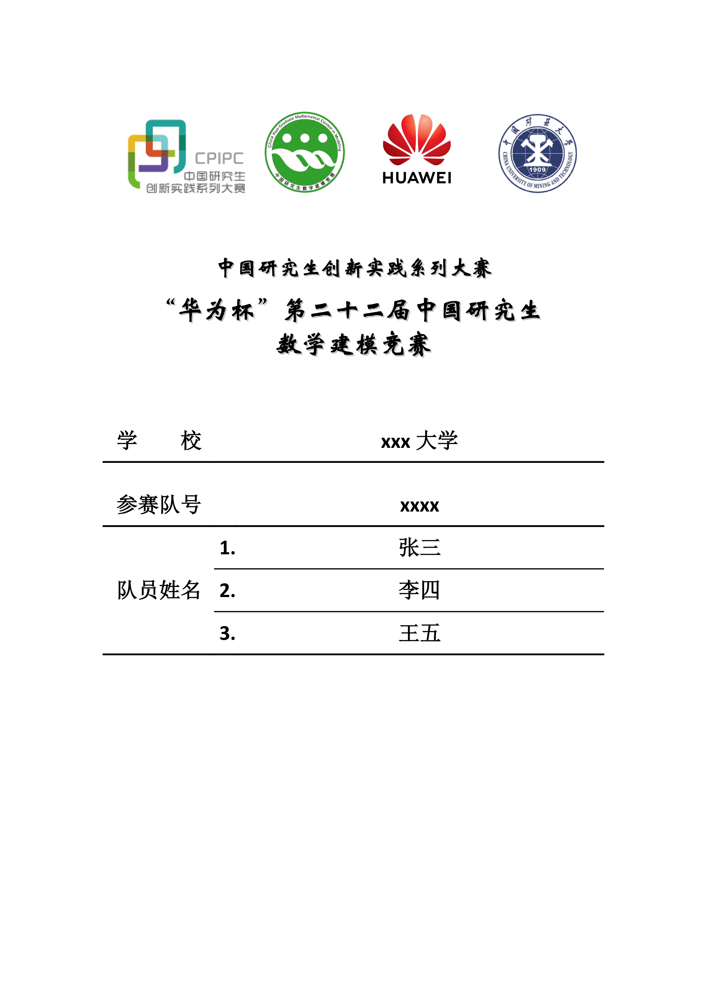

# 研究生数学建模竞赛论文Typst模板 [2025]

> 警告：非官方模板，使用者需**谨慎**采用

## 样式

<!--  -->
<div></div>

这里有完整的例子：[example.pdf](./template/example.pdf)

## 使用

可以放置到本地Typst库中，使用软链接以满足Typst库的识别要求

```tree
├───preview
│   ├───gmcm-thesis-typst
│   │   └───0.1.0 -> path/to/gmcm-thesis-typst
...
```

然后使用以下命令可以生成模板

```shell
typst init "@preview/gmcm-thesis-typst:0.1.0"
```

> 如果不在preview命名空间下，修改至对应命名空间即可
